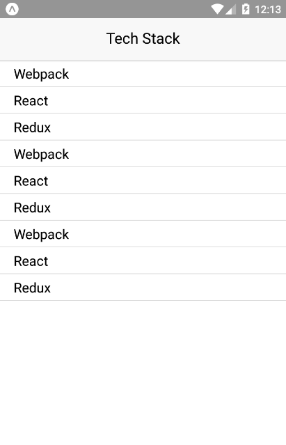

## Learn React Native
### Make Mobile App Using React Native Framework (Tech Stack)
#### This app will be using Redux & Listview Component
In this app show, how to render data in listview using react component and litle bit about redux

### Screenshot:

  

